# Academic Calendar 

Academic Calendar is a highly configurable module that adds a homework and assessment calendar to Gibbon for Students, Parents, and Staff, combining Planner homework deadlines and Markbook assessment dates. 

It is built for Gibbon `v30.0.00+`, and is based on a module called "HWCalendar" by JC Rozo.

## What the Module Does

Academic Calendar can bring together two sources of information in Gibbon into one calendar:

- Homework due dates from Planner
- Markbook assessment dates

The module provides:

- a calendar for Staff, Students, and Parents to see upcoming homework (and assessments if selected in settings)
- dashboard hook tabs for Staff, Student, and Parental dashboards into the Homework calendar
- a configurable assessment overview page for weekly (summative) assessment load by year group
- settings to control visibility, naming, colours, classification, and overview behaviour

### Dashboard Hooks

Academic Calendar can appear as a dashboard hook tab for staff, students, and parents.
- Staff:

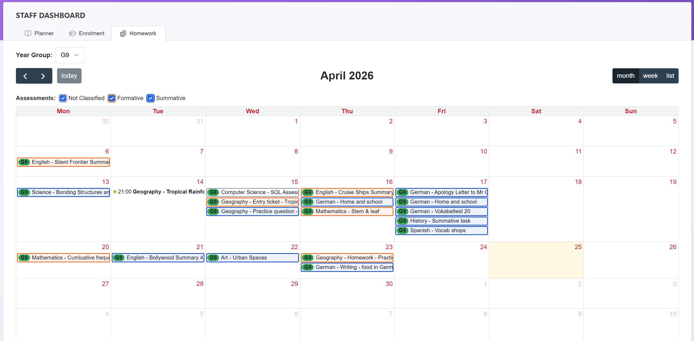

- Parents:

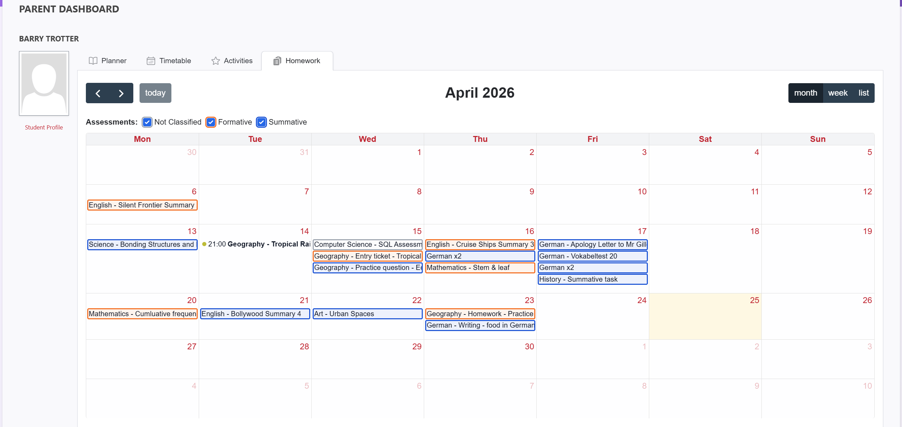

- Students:

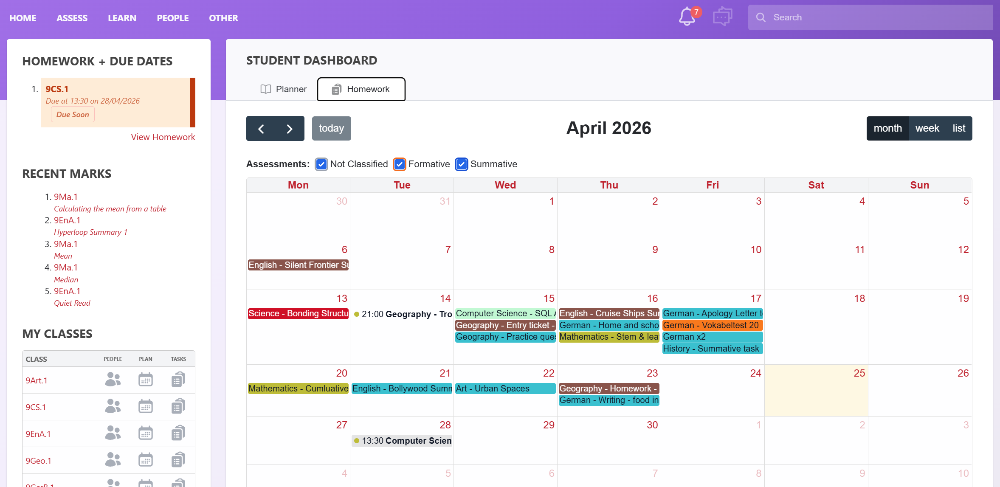

# Main Pages

Once installed, you can find the module under the `Learn` menu → `Academic Calendar`.

## Homework/Assessment Calendar

This is the main calendar page used by Staff, Students, and Parents.

Depending on role and permissions, users can:

- view homework events *(if selected in Settings)* - module defaults to showing this on first install
- view assessment events *(if selected in Settings)*
- filter by assessment classification
- filter by year group in staff view
- open linked Planner or Markbook pages where access is available

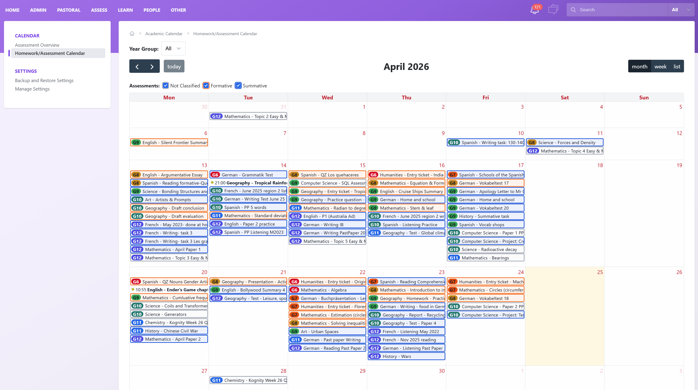

The calendar filter and view options are shown here:

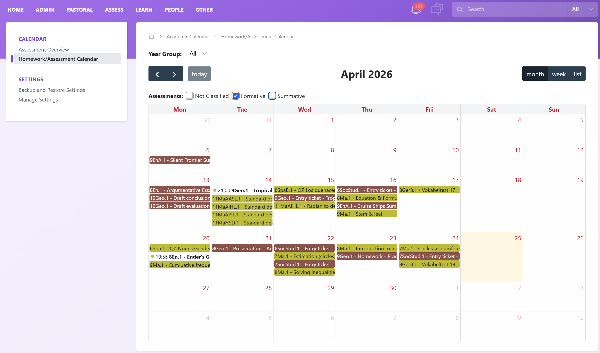

## Assessment Overview

This page shows a weekly overview of assessment load by year group.

It is intended to help staff monitor how many assessment events are set in each week. What appears on this page is controlled by the `Display in Overview` option inside `Assessment Classification Metadata`.

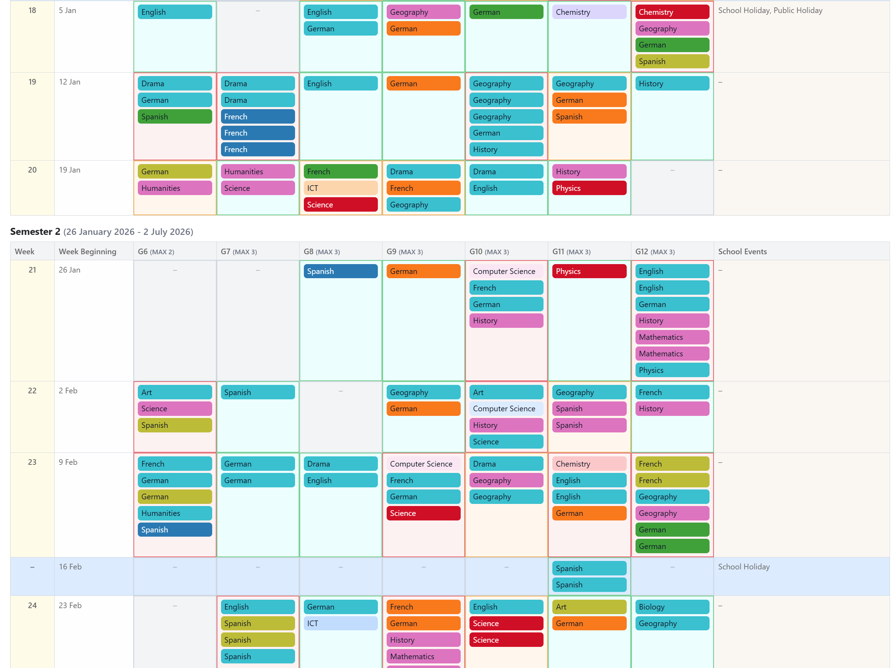

The overview filter panel is shown here:

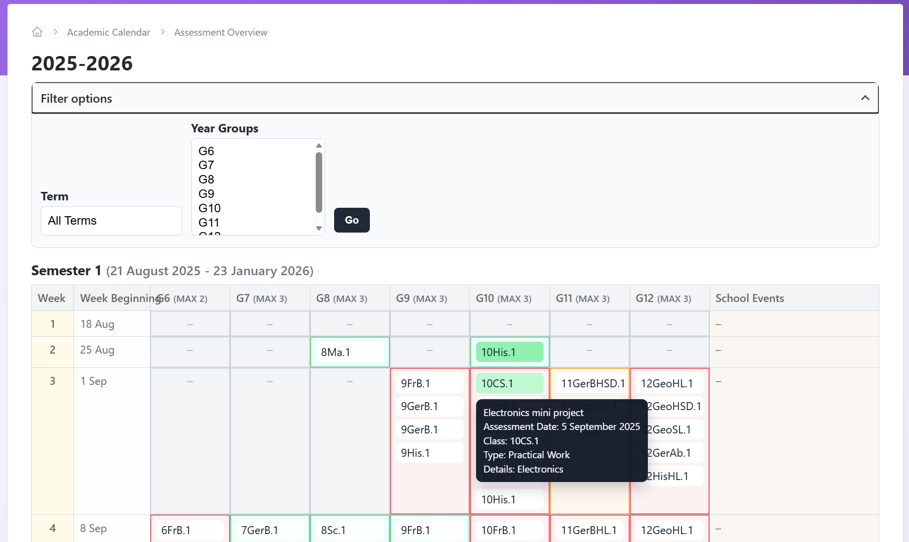

### Notes

- Assessment events come from Markbook date fields and so are rendered as all-day events.
- Homework events come from Planner homework due dates, which can include times.

# Settings
## Backup and Restore Settings

This page exports and restores the module's `gibbonSetting` values for Academic Calendar.

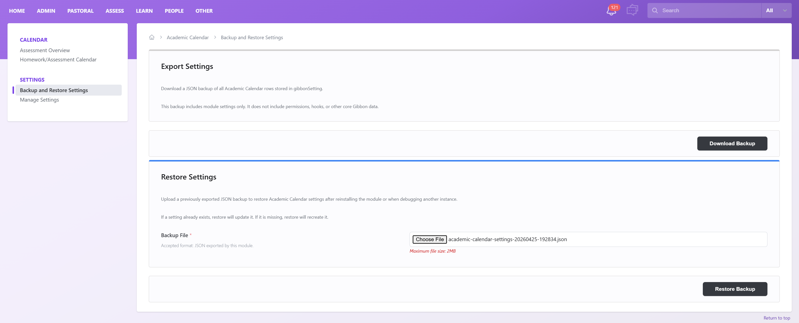

- Settings backup and restore covers Academic Calendar `gibbonSetting` values only. This is useful if you wish to uninstall and reinstall the module in the future.

## Manage Settings

This is the main configuration page for the module.

### Before You Configure

For the best results:

1. enable the year groups you want to use the module
2. decide whether assessment events should appear on the calendar at all
3. decide which assessment classifications should exist in your school
4. assign classifications and visibility to Markbook event types
5. choose which classifications should appear in the overview

## Year Groups

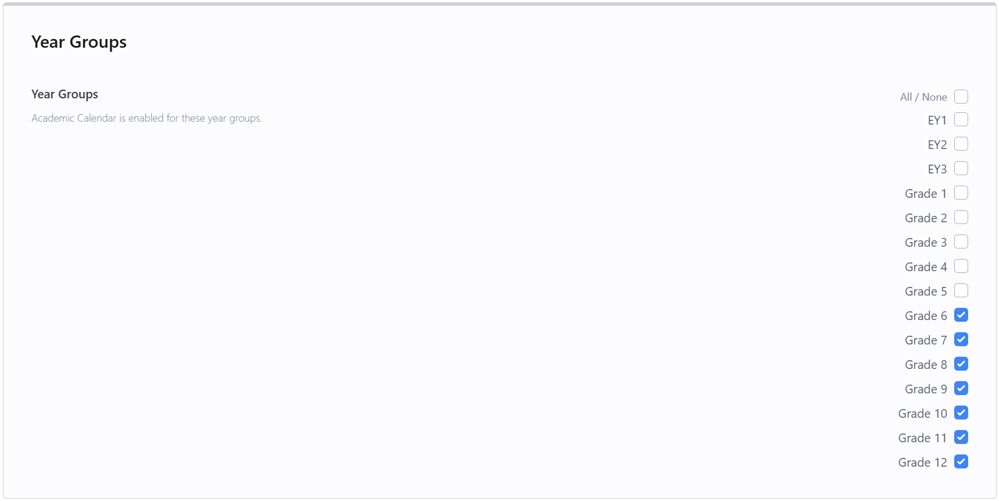

This controls which year groups Academic Calendar is enabled for.

- If no year groups are selected, the module treats that as all year groups enabled.
- Students and Parents only see year groups relevant to them.
- Staff can work across enabled year groups, and can optionally filter further depending on permissions.

## Calendar Display

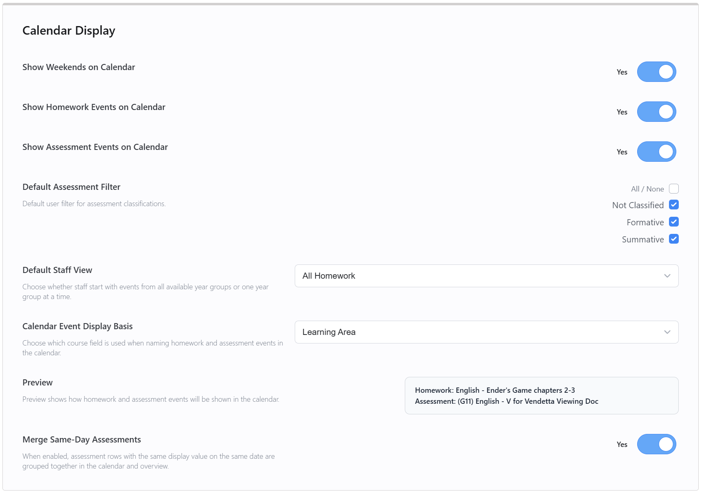

### Show Weekends on Calendar

Controls whether weekends are shown in the calendar layout.

- `Yes`: Saturday and Sunday are visible in supported calendar views.
- `No`: weekends are hidden.

### Show Homework Events on Calendar

Controls whether Planner homework due dates appear in the calendar.

- `Yes`: homework events are shown.
- `No`: homework events are hidden.

### Show Assessment Events on Calendar

Controls whether Markbook assessment dates appear in the calendar.

- `Yes`: assessment events are shown.
- `No`: assessment events are hidden.

Default on first install: `No`

### Default Assessment Filter

This controls which assessment classifications are turned on by default when users open the calendar.

- one checkbox is shown for each configured assessment classification
- `Not Classified` is also included as a fallback option
- this setting only affects the default filter state, not which classifications exist

### Default Staff View

Controls how the staff calendar opens by default.

Options:

- `All Homework`: staff start with all available homework and assessment events in scope
- `Filter by Year Group`: staff start with the year group filter workflow

### Calendar Event Display Basis

This setting controls how homework and assessment events are named in the calendar.

Options:

- `Class Code`
- `Course Short Name`
- `Course Name`
- `Learning Area`

This affects both homework and assessments, so the calendar uses one consistent naming model.

Default on first install: `Class Code`

### Preview

The preview shows how homework and assessment events will be shown in the calendar based on the selected display basis.

### Merge Same-Day Assessments

When enabled, assessment rows with the same display value on the same date are grouped together in the calendar and overview.

- `Yes`: matching same-day assessment rows are merged into one grouped item
- `No`: each assessment row appears separately

This is a shared setting for both the calendar and the overview.

## Assessment Overview

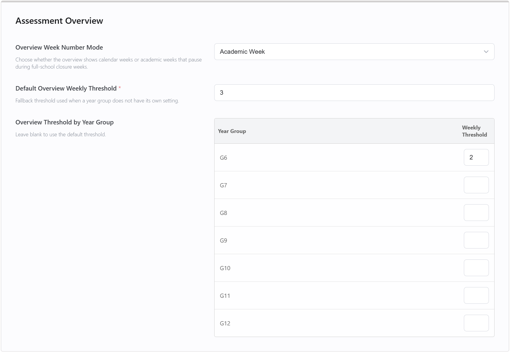

### Overview Week Number Mode

Controls how week numbers are displayed on the overview page.

Options:

- `Calendar Week`: uses the normal calendar week number
- `Academic Week`: uses an academic week count that pauses during full-school closure weeks

### Default Overview Weekly Threshold

Sets the default weekly threshold used in the overview when a year group does not have its own value.

This is the number used to compare weekly assessment load against the threshold shown in the overview table.

### Overview Threshold by Year Group

Lets you set a weekly threshold for individual year groups.

- leave a value blank to use the default overview threshold
- set a number to override the default for that year group

## Event Types

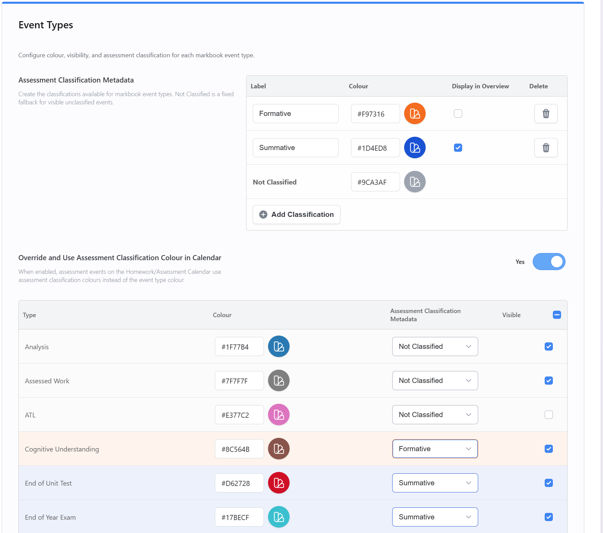

### Assessment Classification Metadata

This table defines the assessment classifications used by this module. Gibbon Markbook may contain many different assessment types, and these settings let you group them into broader categories for Academic Calendar, such as “Summative” and “Formative”, or any other classifications you choose, such as “Graded” and “Ungraded”. You can then choose which of those classifications are shown in the Assessment Overview page.

Each editable classification has:

- `Label`: the name shown in settings and filters
- `Colour`: the classification colour
- `Display in Overview`: whether event types using this classification are included in the Assessment Overview page
- `Delete`: removes the classification

Default classifications and overview behaviour on first install:

- `Formative` -> not shown in overview
- `Summative` -> shown in overview
- `Not Classified` -> not shown in overview

Please note:

- `Not Classified` is a fixed fallback and cannot be deleted. It is used when an event type is visible but has no assigned classification. These types do not appear in the overview configuration
- Any newly added classifications default to `Display in Overview = No`

### Override and Use Assessment Classification Colour in Calendar

Controls whether assessment events use the classification colour from above instead of their event type colour.

- `Yes`: assessment events use the colour from their classification
- `No`: assessment events use the colour assigned to their event type below

Homework events are not affected by this setting.

### Event Types Table

This table configures each Markbook event type.

Each type has:

- `Type`: the Markbook event type name
- `Colour`: the event type colour
- `Assessment Classification Metadata`: the classification assigned to that event type
- `Visible`: whether that event type is shown in the calendar

How this works:

- a type can be visible but left unclassified, in which case it falls into `Not Classified`
- the classification selected here controls calendar filtering and overview inclusion
- only event types assigned to a classification with `Display in Overview` enabled will appear in the overview

## How Classification Filtering Works

On the calendar page:

- users see one assessment filter checkbox per available classification in use by visible event types
- `Not Classified` only appears when there are visible unclassified assessment events in the current calendar window
- filter defaults come from `Default Assessment Filter`

## How Event Titles Work

### Staff

Homework and assessment titles both use the selected `Calendar Event Display Basis`.

Examples:

- `10Eng.1 - Essay Draft`
- `10Eng - Essay Draft`
- `English - Essay Draft`
- `Languages - Essay Draft`

### Students and Parents

Students and Parents also see homework and assessment titles built from the same display-basis setting, so the naming stays consistent across roles.

## Permissions and Actions

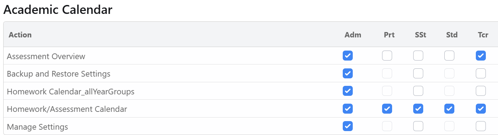

The module includes these actions:

- `Homework/Assessment Calendar`
- `Assessment Overview`
- `Manage Settings`
- `Backup and Restore Settings`
- `Homework Calendar_allYearGroups`

`Homework Calendar_allYearGroups` is a hidden supporting action used for permission-based staff scope.

## Installation

1. Place the module folder in `modules/Academic Calendar`
2. Install the module through Gibbon Module Admin
3. Check action permissions for the roles that should use it
4. Open `Academic Calendar` → `Manage Settings`
5. Configure year groups, classifications, event types, and overview options

## License

This module follows Gibbon's GPLv3 license.

## About

Academic Calendar module written by **Steve Gillott**

GitHub repository: [https://github.com/sgillott/module-academicCalendar](https://github.com/sgillott/module-academicCalendar) -- [Latest Release Version](https://github.com/sgillott/module-academicCalendar/releases)

Gibbon: the flexible, open school platform  
Founded by Ross Parker at ICHK Secondary. Built by Ross Parker, Sandra Kuipers and the Gibbon community ([https://gibbonedu.org/about/](https://gibbonedu.org/about/))   
Copyright © 2010, Gibbon Foundation  
Gibbon™, Gibbon Education Ltd. (Hong Kong)